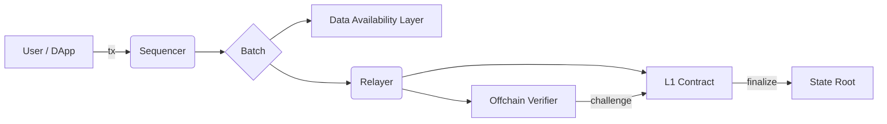
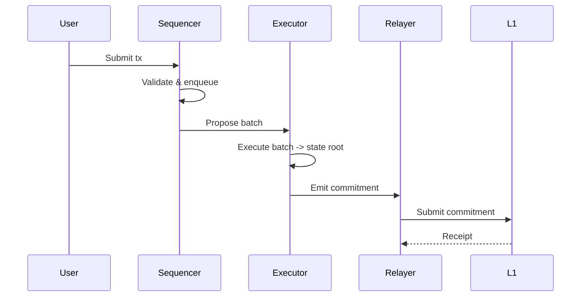

# System Overview

NexaNet is composed of the following major components:

1. **Sequencer** — accepts transactions, orders them, and batches them to the data availability layer.
2. **State Manager / Executor** — applies transactions to the state and produces state roots.
3. **Relayer** — submits batch proofs (or commitments) to the root chain.
4. **Fraud Proof/Verifier** — challenge and verify incorrect state transitions.
5. **Light Client** — for mobile/DApp usage that trusts commitments plus minimal ZK checks.

## Component responsibilities

- **Sequencer**: fast ordering, mempool handling, proposer election.
- **Executor**: deterministic EVM-compatible execution.
- **Relayer**: submits commitments to L1 or to a DA layer.
- **Verifier**: on-chain dispute mechanism.

## Architecture diagram (Mermaid)



## Data flow: transaction lifecycle



## Design trade-offs

- Optimistic vs ZK: NexaNet chooses optimistic execution with light zk checks to balance throughput and prover costs.
- DA layer: Pluggable — can run IPFS, Celestia, or native simple blob storage.

## Realistic config examples

Your [nexanet-config.yaml](./nexanet-config.yaml) file might look like this:

```yaml
network: local
sequencer:
  rpc_port: 8545
  mempool_size: 50000
  max_batch_size: 1024
executor:
  gas_limit: 15000000
  deterministic: true
relayer:
  batch_interval_ms: 5000
  da_provider: celestia
```
